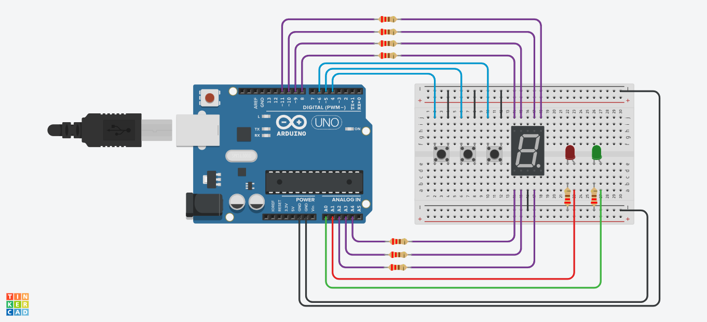

# Primer parcial
## Nombre:
---
* Antuñez, Juan Ignacio.
## Proyecto: Montacargas
---

## Descripción
---
El proyecto consiste en la elaboración de un montacargas que puede subir hasta 9 pisos. Este cuenta con dos leds, uno que indica que está parado y otro en movimiento, un display que muestra en qué piso se encuentra y tres botones, uno para subir, otro para bajar y el último para hacer una parada de emergencia y a su vez encender el sistema si este está apagado.
## Función principal
---
~~~c++
int piso = 0;
bool encendido = false;

void loop()
{
    comprobar_arranque(encendido);
    if (encendido)
    {
        actualizar_led(false);
        display(piso);
        subir_bajar(piso);
    }
}
~~~
Se inicializan dos variables, una marcará los pisos y la otra servirá para determinar el encendido del sistema. La función principal primero llama a **comprobar_arranque**, esta recibe por referencia a *encendido* y espera a que el usuario prenda el sistema utilizando el botón de parar, luego cambia el valor de *encendido* a True.
~~~c++
void comprobar_arranque(bool &encendido)
{
    if (!encendido)
    {
        while (digitalRead(parar) != 0)
        {
            delay(100);
        }
        encendido = true;
    }
}
~~~
Una vez encendido el sistema se llama a la función **actualizar_led** que cambia el estado de los leds según el booleano recibido por parámetro, significando true que el montacargas se encuentra en movimiento y false que este está parado.
~~~c++
void actualizar_led(bool estado)
{
    if (estado)
    {
        digitalWrite(led_rojo, LOW);
        digitalWrite(led_verde, HIGH);
    }
    else
    {
        digitalWrite(led_rojo, HIGH);
        digitalWrite(led_verde, LOW);
    }
}
~~~
Después se llama a **display** que recibe por parametro el numero de *piso* y se muestra esté en el display 7 segmentos.
~~~c++
void display(int num)
{
    switch (num)
    {
    case 0:
        digitalWrite(A, HIGH);
        digitalWrite(B, HIGH);
        digitalWrite(C, HIGH);
        digitalWrite(D, HIGH);
        digitalWrite(E, HIGH);
        digitalWrite(F, HIGH);
        break;
    case 1:
        digitalWrite(B, HIGH);
        digitalWrite(C, HIGH);
        break;
    case 2:
        digitalWrite(A, HIGH);
        digitalWrite(B, HIGH);
        digitalWrite(D, HIGH);
        digitalWrite(E, HIGH);
        digitalWrite(G, HIGH);
        break;
    case 3:
        digitalWrite(A, HIGH);
        digitalWrite(B, HIGH);
        digitalWrite(C, HIGH);
        digitalWrite(D, HIGH);
        digitalWrite(G, HIGH);
        break;
    case 4:
        digitalWrite(B, HIGH);
        digitalWrite(C, HIGH);
        digitalWrite(F, HIGH);
        digitalWrite(G, HIGH);
        break;
    case 5:
        digitalWrite(A, HIGH);
        digitalWrite(C, HIGH);
        digitalWrite(D, HIGH);
        digitalWrite(F, HIGH);
        digitalWrite(G, HIGH);
        break;
    case 6:
        digitalWrite(A, HIGH);
        digitalWrite(C, HIGH);
        digitalWrite(D, HIGH);
        digitalWrite(E, HIGH);
        digitalWrite(F, HIGH);
        digitalWrite(G, HIGH);
        break;
    case 7:
        digitalWrite(A, HIGH);
        digitalWrite(B, HIGH);
        digitalWrite(C, HIGH);
        break;
    case 8:
        digitalWrite(A, HIGH);
        digitalWrite(B, HIGH);
        digitalWrite(C, HIGH);
        digitalWrite(D, HIGH);
        digitalWrite(E, HIGH);
        digitalWrite(F, HIGH);
        digitalWrite(G, HIGH);
        break;
    case 9:
        digitalWrite(A, HIGH);
        digitalWrite(B, HIGH);
        digitalWrite(C, HIGH);
        digitalWrite(D, HIGH);
        digitalWrite(F, HIGH);
        digitalWrite(G, HIGH);
        break;
    }
}
~~~
Al final de la función principal llama a **subir_bajar** que recibe el *piso* por referencia, y lo que hace esta función es determinar si se apreto el boton para subir o para bajar, se suma o se resta un valor a *piso* según corresponda y se lo pasa por parámetro a la función **montacarga**.
~~~c++
void subir_bajar(int &piso)
{
    if (digitalRead(subir) == 0)
    {
        if (piso < 9)
        {
            piso++;
            montacarga(piso);
        }
    }
    else if (digitalRead(bajar) == 0)
    {
        if (piso > 0)
        {
            piso--;
            montacarga(piso);
        }
    }
}
~~~
Esta función primero actualiza los leds para mostrar que está en movimiento. Luego dentro de un for espera los tres segundos que tarda en subir, mientras comprueba que no se toque el botón para hacer una parada de emergencia, un vez terminado se llama a **display_off** que apaga todos los leds del display y se imprime por consola el piso. Al volver a la función principal esta mostrará el nuevo piso e indicará que el montacargas está parado.
~~~c++
void montacarga(int piso)
{
    actualizar_led(true);
    for (int i = 0; i < 3000; i++)
    {
        if (digitalRead(parar) == 0)
        {
            boton_emergencia(true);
        }
        delay(1);
    }
    display_off();
  	Serial.print("Se encuentra en el piso ");
  	Serial.println(piso);
  	delay(100);
}

void display_off()
{
    digitalWrite(A, LOW);
    digitalWrite(B, LOW);
    digitalWrite(C, LOW);
    digitalWrite(D, LOW);
    digitalWrite(E, LOW);
    digitalWrite(F, LOW);
    digitalWrite(G, LOW);
}
~~~
En caso de que se apretara el botón de emergencia mientras el montacargas esté en movimiento, se utiliza la función **boton_emergencia**, que actualiza los leds para mostrar que se paró y entra en un bucle esperando que el usuario vuelva a apretar el botón para poder actualizar de nuevo los leds y salir del bucle. Los delays minimizan el rebote del botón. 
~~~c++
void boton_emergencia(bool emergencia)
{
    actualizar_led(false);
    delay(200);
    while (emergencia)
    {
        if (digitalRead(parar) == 0)
        {
            emergencia = false;
            actualizar_led(true);
            delay(200);
        }
        delay(200);
    }
}
~~~
Una vez terminado vuelve a la función montacargas a esperar lo que resta de los tres segundos.
## Link al proyecto
* [Proyecto](https://www.tinkercad.com/things/7SwFpq27hWp)
---